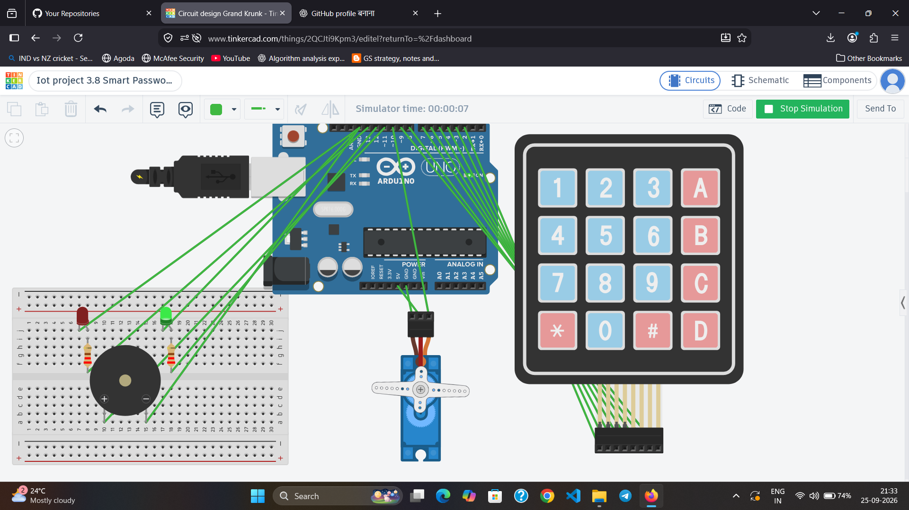

# 🔐 Smart Password Door Lock

An Arduino-based smart door lock system that uses a keypad for password-based access control and a servo motor to lock or unlock the door.

## 🎯 Objective

To build a simple electronic door lock system where access is granted only when the correct password is entered.

## 🧩 Components

- Arduino Uno
- 4×4 Keypad
- Micro Servo Motor
- Buzzer
- Green LED
- Red LED
- 2 × 220Ω Resistors
- Breadboard
- Jumper Wires

## 🔌 Circuit Connections

| Component | Arduino |
|---|---|
| Keypad R1 | D2 |
| Keypad R2 | D3 |
| Keypad R3 | D4 |
| Keypad R4 | D5 |
| Keypad C1 | D6 |
| Keypad C2 | D7 |
| Keypad C3 | D8 |
| Keypad C4 | D9 |
| Servo Signal | D10 |
| Servo VCC | 5V |
| Servo GND | GND |
| Buzzer (+) | D11 |
| Buzzer (-) | GND |
| Green LED | D12 through 220Ω |
| Red LED | D13 through 220Ω |

## ⚙️ Working

The system asks the user to enter a password using the keypad.

- 🔓 **Correct password (`1234`)** → Green LED ON + Servo moves to 90°
- 🔒 After a short delay → Servo returns to 0°
- ❌ **Wrong password** → Red LED ON + Buzzer sounds
- `*` → Clears the entered password
- `#` → Submits the entered password

## 🔄 System Flow

**Keypad Input → Arduino → Password Verification → Servo / LED / Buzzer**

## 📸 Circuit

## 🛠️ Simulation

The project was designed and tested using **Tinkercad Circuits**.

## 💻 Technologies

- Arduino Uno
- C/C++ (Arduino)
- 4×4 Keypad
- Servo Motor
- Tinkercad Circuits

## 🧠 Concepts Learned

- Keypad interfacing
- Password-based access control
- Servo motor control
- Digital input/output
- Conditional logic
- Buzzer and LED control

## 🚀 Future Improvements

- Add an LCD/OLED display
- Add multiple password attempts and lockout
- Add RFID authentication
- Add ESP32 Wi-Fi connectivity
- Add mobile/web-based access control

---

### 👩‍💻 Author

**Tanisha Karan**  
B.Tech CSE (IoT) Student
